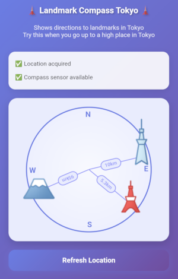

# Overview / 概要

When you go up high, don’t you want to see if you can spot any famous landmarks?

Landmark Compass Tokyo is a web-based compass application that shows the direction to famous landmarks in Tokyo from your current location.
The app uses your smartphone's GPS and compass sensors to provide real-time directional guidance to Tokyo Tower and Mount Fuji, etc.

Try this when you go up to a high place in Tokyo!

But wait — you can also copy this project, swap out the landmarks with ones from your city, and make your own local version. Give it a try!

\[日本語\]

高いところに登ったら、そこから有名なランドマークが見えるか確かめたくなりませんか？

この「Landmark Compass Tokyo」は、東京の有名ランドマークへの方角を示すWebベースのコンパスアプリです。
スマホのGPSとコンパスを使って、東京タワー、富士山などの方角をリアルタイムに表示します。

東京で高いところに登ったら、使ってみてください！

あ、このプロジェクトをコピーしてあなたの街のランドマークに入れ替えれば、あなたの街バージョンも作れますよ。ぜひ試してみてください。

# Screenshots / スクリーンショット



# Requirements / 動作条件

## Privacy & Permissions / プライバシーと許可

The app displays a startup dialog that explains the following privacy protections and requests permission for location and device orientation access:

- Location and orientation data is processed only on your device
- Location is used solely for calculating directions to landmarks
- Compass sensor is used only to detect device orientation
- No personal information is collected or transmitted

\[日本語\]

アプリは起動時に、以下のプライバシー保護について説明し、位置情報とデバイスの向きのアクセス許可を求めるダイアログを表示します。

- 位置情報およびデバイスの向きの情報はお使いのデバイス上でのみ処理されます
- 位置情報はランドマークの方角計算のみに使用されます
- 方位センサーはデバイスの向きを検出するためのみに使用されます
- 個人情報の収集や外部送信は一切行いません

## HTTPS Required / 設置するサイトにはHTTPSが必須です

This application requires HTTPS to access device sensors (GPS and compass). The app will not function properly over HTTP due to browser security restrictions.

\[日本語\]

このアプリはデバイスのセンサー（GPSとコンパス）にアクセスするため、HTTPS接続が必要です。ブラウザのセキュリティ制限により、HTTP接続では正常に動作しません。

# Customization / カスタマイズ

## Distance Units / 距離の単位

Change the distance unit in `scripts/config.js`:

```javascript
const distanceConfig = {
    defaultUnit: 'km',
    currentUnit: 'km'    // Change to 'miles' for imperial units
};
```

- `currentUnit: 'km'` for metric (kilometers/meters)
- `currentUnit: 'miles'` for imperial (miles/feet)

\[日本語\]

`scripts/config.js` で距離の単位を変更できます。

```javascript
const distanceConfig = {
    defaultUnit: 'km',
    currentUnit: 'km'    // ヤード・ポンド法の場合は 'miles' に変更
};
```

- `currentUnit: 'km'` メートル法（キロメートル/メートル）
- `currentUnit: 'miles'` ヤード・ポンド法（マイル/フィート）

## Adapting to Other Cities / 他の都市への対応

To customize this app for your city, modify the landmarks in `scripts/config.js`:

```javascript
const landmarks = {
    'landmark1': {
        latitude: 40.7589,  // Your landmark's latitude
        longitude: -73.9851 // Your landmark's longitude
    },
    'landmark2': {
        latitude: 40.6892,
        longitude: -74.0445
    }
    // Add more landmarks as needed
};
```

Then replace images in the `images/` folder with your own landmark images. File names should match the landmark IDs in `config.js`.

For example:
- `landmark1` → `images/landmark1.png`
- `landmark2` → `images/landmark2.png`

\[日本語\]

あなたの街に対応させるには、 `scripts/config.js` のランドマーク情報を変更してください。

```javascript
const landmarks = {
    'landmark1': {
        latitude: 40.7589,  // ランドマークの緯度
        longitude: -73.9851 // ランドマークの経度
    },
    'landmark2': {
        latitude: 40.6892,
        longitude: -74.0445
    }
    // 必要に応じてランドマークを追加
};
```

そして、 `images/` フォルダの画像をあなたの街のランドマーク画像に置き換えてください。ファイル名は `config.js` のランドマークIDと一致させる必要があります。

例：
- `landmark1` → `images/landmark1.png`
- `landmark2` → `images/landmark2.png`

# Calculation Formulas / 計算式

- Distance Calculation: Using the Haversine formula
- Bearing Calculation: Using spherical trigonometry

\[日本語\]

- 距離計算: Haversine公式を使用
- 方位計算: 球面三角法を使用

# License / ライセンス

Copyright (C) 2025, cubic9com All rights reserved.

This project is licensed under the MIT license.

See the `LICENSE` file for details.
